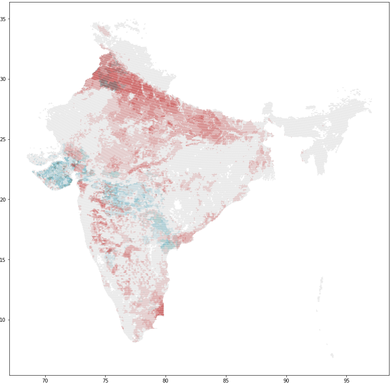

=========
Bivariate
=========
Straighforward tool to help you in your bivariate maps journey

Installation
------------
This package is not available on PyPi so it must be installed from git

.. code-block:: console

    $ pip install git+https://github.com/vizzTools/Bivariate.git

or locally from the cloned repository by doing

.. code-block:: console

    $ pip install .

If you have issues installing either from git or locally, check that pip version is >= 19. (Why: https://github.com/python-poetry/poetry/issues/321)

Usage
-----

Simply select your prefered color palette from `bivariate palette generator`_, copy the color list and

.. code-block:: python

        from bivariate import BivariateColorMap

        palette = ["#e8e8e8", "#d9a4a4", "#c85a5a", "#a7cad3", "#a7a4a4", "#a75a5a", "#64acbe", "#64a4a4", "#645a5a"]
        bivar = BivariateColorMap(palette)
        bivar.plot_color_square()

Then, if you are using a :code:`DataFrame` or :code:`GeoDataFrame`, to compute the the classes simply do

.. code-block:: python

        classes = bivar.classify(data.var1, data.var2)

And, with :code:`geopandas`, plot the resulting bivariate map with

.. code-block:: python

        data.plot(color=classes.map(bivar.cmap()), categorical=True, figsize=(14, 14))
        bivar.plot_color_square(show_labels=False)
        plt.plot()

TODO
----

* Add classifier for raster data
* Fix the installation of the package
* Add installation instructions

.. _`bivariate palette generator`: https://observablehq.com/@benjaminadk/bivariate-choropleth-color-generator
